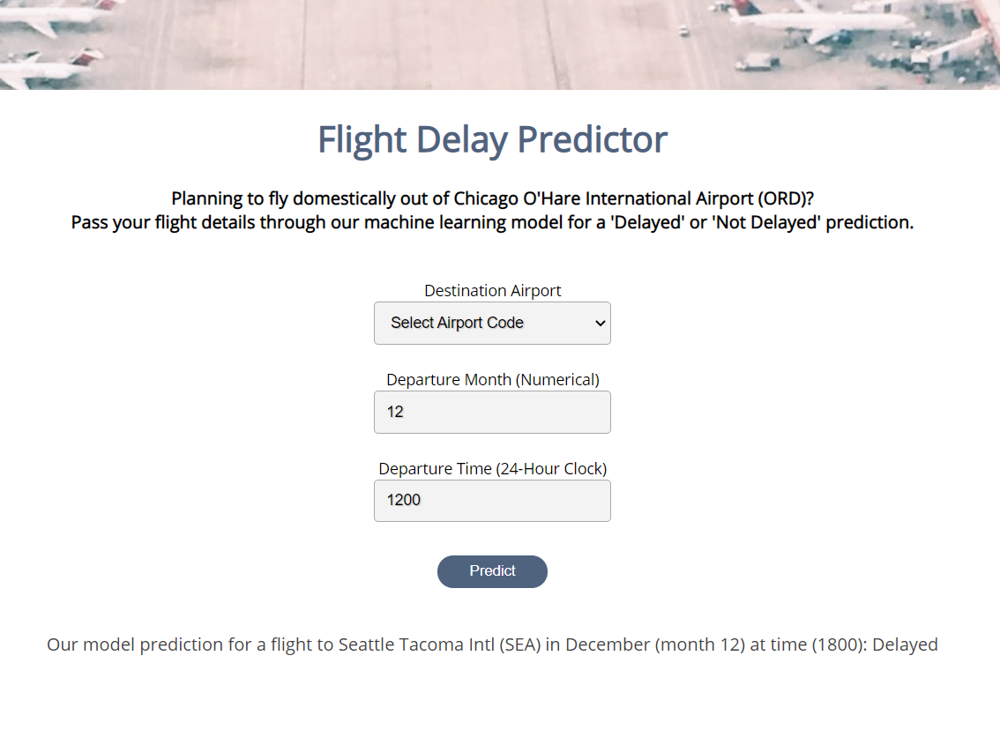
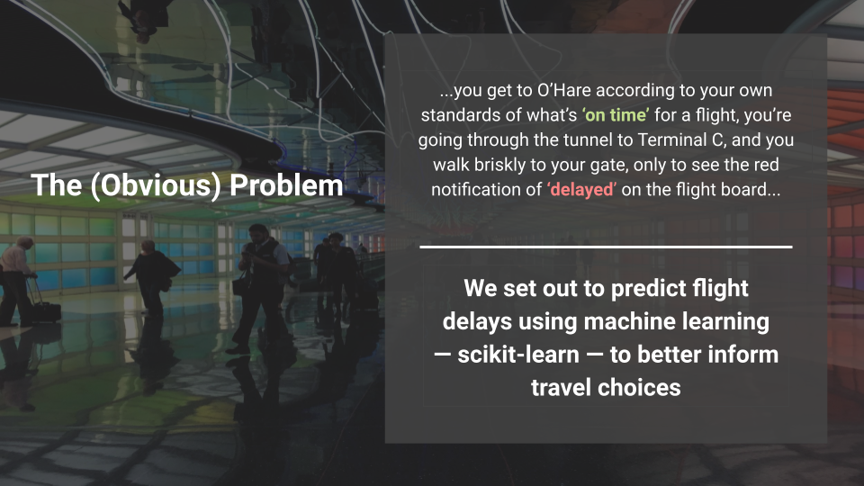
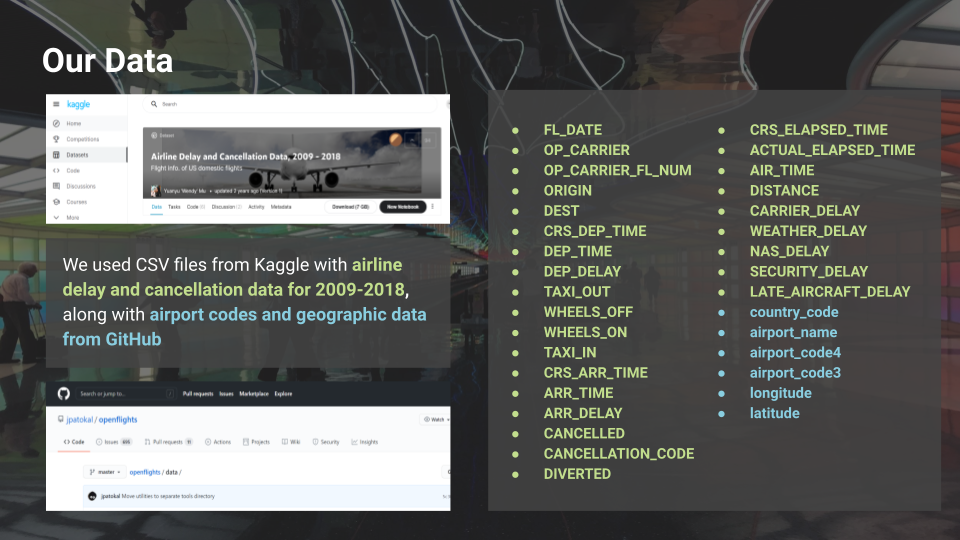
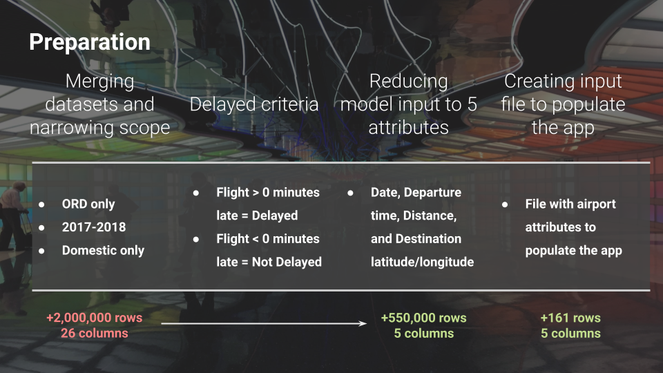
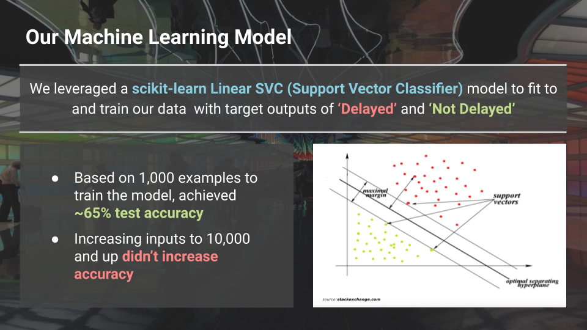

# final-project

## Deployment Link
**[http://flight-delay-predictor-ord.herokuapp.com/](http://flight-delay-predictor-ord.herokuapp.com/)**

## Datasets

[Airline Delay and Cancellation Data, 2009 - 2018](https://www.kaggle.com/yuanyuwendymu/airline-delay-and-cancellation-data-2009-2018) 
[OpenFlights: Airport, Airline and Route Databases](https://github.com/jpatokal/openflights/tree/master/data)

 

### Our Flight Delay Predictor: 

 
 

 
 

 
 

 
 

 
 

 
 

## Citation

[Favicon.ico](./static/images/favicon.ico) Airplane emoji is from the open source project [Twemoji](https://twemoji.twitter.com/). Graphics are copyright 2020 Twitter, Inc and other contributors. Graphics licensed under [CC-BY 4.0](https://creativecommons.org/licenses/by/4.0/). 
